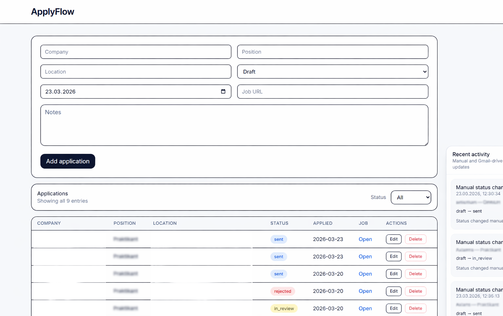

# ApplyFlow

gApplyFlow is a fullstack web application for tracking job applications and automating status updates from Gmail.

## Features
- Track job applications
- Application status workflow
- Event / activity history
- Gmail integration
- Automatic status updates from emails
- React + FastAPI + PostgreSQL
- Fully Dockerized setup

## Tech Stack
**Frontend:** React, TypeScript, Vite, Tailwind  
**Backend:** FastAPI, SQLAlchemy, Alembic, PostgreSQL, Gmail API  
**Infrastructure:** Docker, Docker Compose

## Run with Docker
Start the entire project with one command:

docker compose up --build

Frontend → http://localhost:5173  
Backend → http://localhost:8000  
API Docs → http://localhost:8000/docs

Database migrations run automatically on backend start.

## Status Flow
draft → sent → in_review → interview → accepted / rejected

Final statuses: accepted, rejected

## In Development
- Automatic Gmail sync with configurable intervals
- UI improvements
- Dashboard / statistics
- Export / Import applications
- Background jobs

## Screenshots
